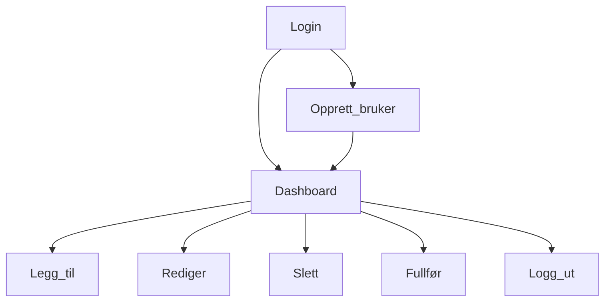
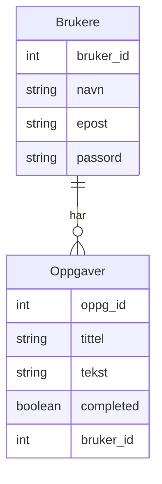

# Prosjekt: Task manager

Målet er å lage en enkel task manager der en person kan opprette, redigere, fullføre og slette opgpaver.  
Tiltenkt målgruppe er for eksempel en student, som ønsker en enkel, no-fuss sjekkliste.

## Tech stack
* java
* postgreSQL
* typeScript
* html5
* css3 / bootstrap / designsystemet

## Hovedfunksjonalitet:
* Registrere en user
* Logge inn og logge ut

* Opprette en oppgave
* Endre en oppgave
* Slette oppgave
* Markere oppgave som fullført

## Ideer for framtidige forbedringer
* Kategorier / tags
* Påminnelser
* Deadline - kalenderfunksjon

## Brukerkrav
* Som user ønsker jeg å kunne lage en konto og å kunne logge inn på denne
* Som user ønsker jeg å opprette oppgaver
* Som user ønsker jeg å markere en oppgave som fullført
* Som user ønsker jeg å kunne endre en opprettet oppgave
* Som user ønsker jeg å kunne slette en oppgave fra listen

## Design
### Flyt

### Database

### Endepunkter
* POST /login
* POST /registrer
* GET  /oppgaver
* POST /oppgaver
* PUT /oppgaver/:id
* DELETE /oppgaver/:id