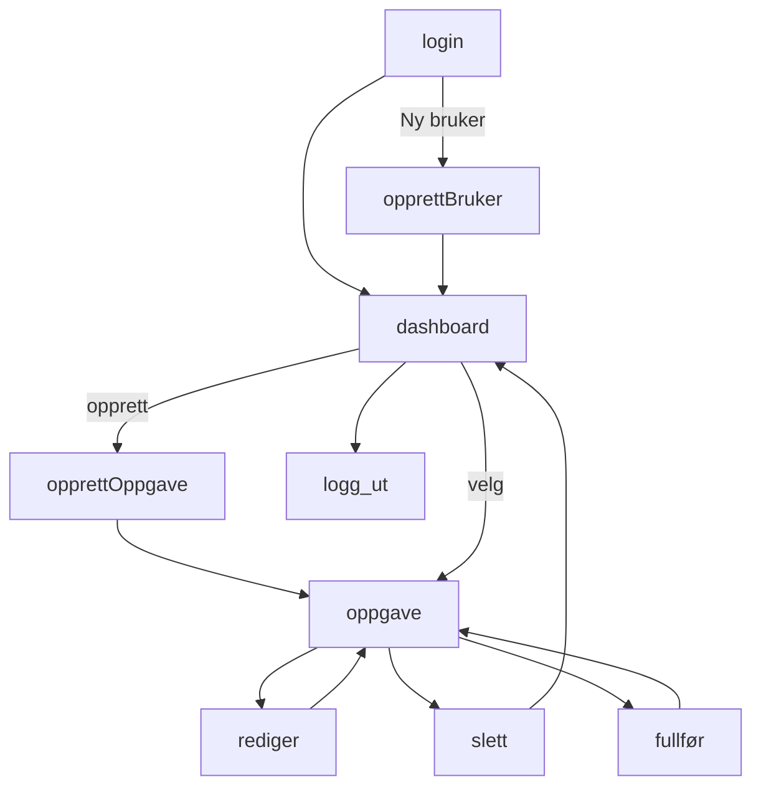
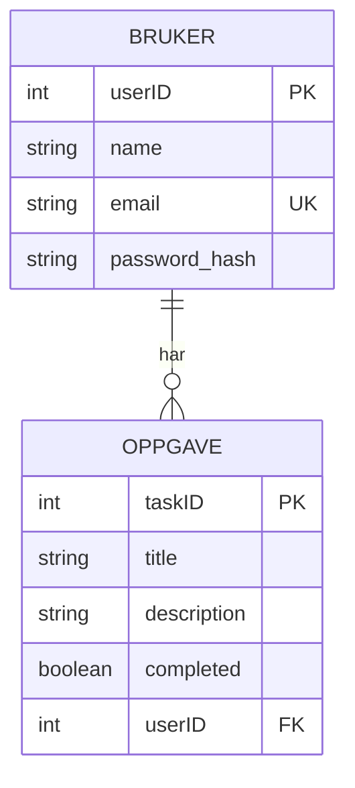

# Prosjekt: Task manager

Målet er å lage en enkel task manager der en person kan opprette, redigere, fullføre og slette egne oppgaver.  

Per nå er det en veldig tidlig POC - en første iterasjon.   
Tiltenkt målgruppe er for eksempel en student, som ønsker en enkel, no-fuss sjekkliste.

## Tech stack (mål)
* java
* postgreSQL
* typeScript
* html5
* css3 
* bootstrap 
* DigDirs designsystem, som et alternativ til bootstrap

## Hovedfunksjonalitet:
Oppgavehåndtering:
* Opprette en oppgave
* Vise egne oppgaver
* Redigere en oppgave
* Markere en oppgave som fullført
* Slette en oppgave

Brukerhåndtering:
* Registrere en bruker
* Logge inn 
* Logge ut

## Ideer for framtidige forbedringer
* Kategorier/tags for sortering av oppgavene
* Påminnelser / deadlines
* Utvide løsningen til et kanban board

## Brukerkrav
* Som bruker ønsker jeg å kunne lage en konto for å bruke task manageren
* Som bruker ønsker jeg å logge inn på kontoen min for å få tilgang til mine oppgaver
* Som bruker ønsker jeg å opprette oppgaver slik at jeg får oversikt over hva jeg skal gjøre
* Som bruker ønsker jeg å markere en oppgave som fullført så jeg kan se hva jeg har gjort
* Som bruker ønsker jeg å kunne redigere en opprettet oppgave, slik at jeg kan endre informasjonen
* Som bruker ønsker jeg å kunne slette en oppgave fra listen hvis jeg ikke lenger trenger den

## Akseptansekrav
Bruker:
* En bruker skal kunne registrere seg med navn, epost og passord
* En bruker skal kunne logge inn med epost og passord
* En innlogget bruker skal kun ha tilgang til sine egne oppgaver
* En bruker skal kunne logge ut

Oppgaver:
* En innlogget bruker skal kunne opprette en oppgave
* En oppgave skal minst ha en tittel
* En bruker skal kunne se sine egne oppgaver
* En bruker skal kunne redigere sine egne oppgaver
* En bruker skal kunne markere sine egne oppgaver som fullførte
* En bruker skal kunne slette egne oppgaver
* En bruker skal ikke kunne lese, endre eller slette en anen brukers oppgaver

## Design
### Brukerflyt

### Database

### Endepunkter
Alle task-endepunkter skal kreve at brukeren er autentisert, slik at ingen uvedkommende får tilgang til oppgavelisten.

Autentisering:
* POST /login
* POST /register
* POST /logout

Oppgaver:
* GET  /tasks
* POST /tasks
* PUT /tasks/:id
* DELETE /tasks/:id